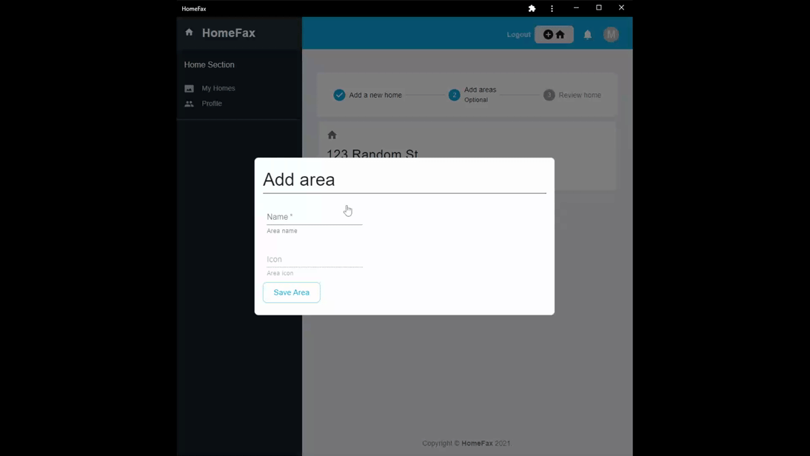

# HomeFax

## Description

Homefax is an application designed to help homeowners keep updated records of their homes and all maintenance involved.

## User Stories

- AS A Home Owner/Renter, I want to log and retrieve details of the home
  improvement and maintenance activities for all of the properties.

- AS A Home Seller/Buyer, I want to transfer the properties HomeFax ownership
  from the Home Seller to the Home Buyer.

## Table of Contents

- [Installation](#installation)
- [Usage](#usage)
- [Contributions](#contributions)
- [Testing Information](#testing)
- [License](#license)
- [Questions](#questions)

## Installation

User only needs a working browser to use this application. If the user wishes, they can download the application as a working PWA.

## Usage

Sign up as a new user:  
  
To get started, you will need to create an account. Fill the forms out with your first and last name, date of birth, an email address, desired user name, and a password. Once these fields are filled out, click on "Sign Up".

Adding a home:  
  
Once you've sucessfully created an account, you will be directed to the home screen. From here you can read about what homefax is and how it works, or you can get started adding your home(s). To do this, click at the top right of the page where the "+ House" icon is.

Adding an area (Optional):  
  
To add an area, simply click the "Add Area" button, then fill out the name form to describe the name of the area, then click on "Save Area". You can add as many areas as you want to. When you are ready to move forward, click next.

Review Home/ Add Attribute (Optional):  

Click on "Take Me To My Home" when you are done adding areas to your home. Here we will be directed to the "My Homes" page where you will be presented with your newly added home and any areas assigned to it. The next step here is optional but if you want you can add an "Attribute" to an area. For example: In the living room, we have an attribute of "Ceiling Fan". To do this, click the drop down arrow on your home area card and click "Add Attribute". Then fill in the form with the attribute type of your choice and click "Save Attribute".

Add Attribute Detail (Optional):  

To give our attribute more specificity, we can give it a detail, a detail value, and an associated date. For example: Our ceiling fan has a detail of "Purchased from home depot", our detail value is a link to where the fan was purchased online, and a date is assigned to remind us when our fan was purchased. To do this, click on the blue attribute link and fill out each form. Once done, click "Save Detail".

Generate Report:  

To generate a report, simply click on "Generate Report". A PDF file will be generated containing the home, all of its areas, attributes, and details formatted nicely. You can even click on detail links if provided in the details.

Transfer Home:  

If a user wants to transfer a home and all of its areas/attributes/details, all they need to do is click "Transfer Home" and enter the recipients valid email address that they use to log into homefaxt with, then click "Transfer Home". The transferrer can immediately navigate back to the "My Homes" page and see they no longer have that home in their list. Once the reciever logs back in, a bell notification will be displayed with a number of pending transfers in red. Once they click the notification, they can choose to accept or decline the transfer. After the home is accepted, they can navigate to their "My Homes" page and see that the home has successfully been transferred into their account.

Other Features:
If a user wants to remove a house from their homes page manually, they can do so in their "My Homes" page. If the user navigates to the "Profile" page, they can update their email address, first and last names, password, and even delete their account entirely.

## Contributors

Nic Brown  
Blake Wright  
Bryan Barnes  
Eddie Reed

## Testing

No tests are necessary at the moment.

## License

This project is covered under a/an MIT license. For more information see GitHub
documentation on licensing a project
[here](https://docs.github.com/en/communities/setting-up-your-project-for-healthy-contributions/adding-a-license-to-a-repository).

## Questions

​For questions, feel free to get in touch with any of our dev team members.  
Nic Brown [Github](https://github.com/brownnicholasj) / [Email](mailto:brownnicholasj.dev@gmail.com)  
Blake Wright [Github](https://github.com/BTDubbzzz) / [Email](mailto:btdubbzzz@gmail.com)  
Bryan Barnes [Github](https://github.com/bryan-barnes12) / [Email](mailto:theonlysweetbeebles@gmail.com)  
Eddie Reed [Github](https://github.com/relentlessreed) / [Email](mailto:relentlessreed@gmail.com)
